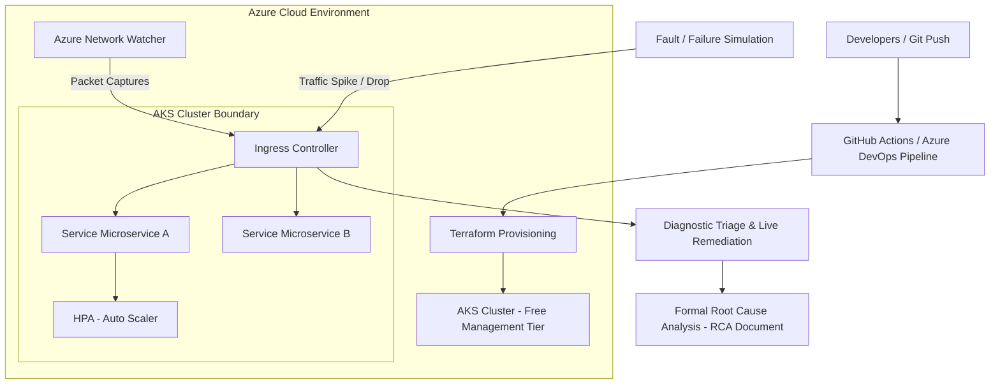

# Project 2

The goal for this project is the deployment of a **Resilient AKS Cluster** and managing simulated incidents. You will be working with Infrastructure-as-Code (IaC), Kubernetes orchestrations, CI/CD automation, and active SRE incident response protocols.
Your team will operate under an **Agile/Scrum** framework using a shared **Trello Board** to organize sprints, assign backlog items, and track deliverables.

---

## Project Specifications

* **Project Type:** Group Project (Teams of 6/7)
* **Methodology:** Agile / Scrum (Managed via Trello, or other kanban boards)
* **Timeline:** Weeks 6, 7, 8, & 9

---

## Required Technologies

* **Kubernetes & Cloud Infrastructure:** Azure Kubernetes Service (AKS), Ingress Controllers (NGINX/Traefik)
* **Infrastructure as Code (IaC):** Terraform or Bicep
* **CI/CD Pipelines:** GitHub Actions or Azure DevOps
* **Network & Diagnostic Tools:** Azure Network Watcher, packet capture utilities (`tcpdump`, `Wireshark`), `kubectl` CLI
* **Local Cluster Environments:** Minikube or K3s inside WSL2/Docker
* **App Development:** Python, FastAPI, Docker, JWT

---

## Preliminary Work

### Scrum Board Setup (Trello)

* Create a group Trello board formatted with clear Agile columns: `Backlog`, `Sprint Backlog`, `In Progress`, `In Review / QA`, and `Done`.
* Break down all required features into concrete user stories and technical tasks, assigning story points and owners for each item.

### System Architecture & Workflow

Review the Infrastructure-as-Code pipeline, cluster traffic routing, and incident diagnostic flow below before beginning your sprint planning:

### Glossary of Terms

#### Infrastructure-as-Code (IaC)

The process of managing and provisioning computer data centers through machine-readable definition files, rather than physical hardware configuration or interactive configuration tools.

#### Ingress Controller

A specialized load balancer for Kubernetes environments that manages external access to services within a cluster, typically providing HTTP/HTTPS routing.

#### Horizontal Pod Autoscaler (HPA)

An automated Kubernetes component that scales the number of pod replicas in a deployment based on observed CPU utilization or other custom metrics.

#### Root Cause Analysis (RCA)

A structured problem-solving methodology used to identify the fundamental cause of an outage, system fault, or incident to prevent its recurrence.

---

## Required Features

### 1. Microservice API with Frontend

Create a microservice backend with a frontend interface for the client to interface with. The app can be whatever you would like but it will need to be proposed first via a project proposal document and after approval it can be developed.

* **Requirements:**
* REST API
* JWT Auth / Security
* Microservice Architecture
* Monitoring
* Persistence (PSQL)

### 1. Automated Infrastructure Provisioning (IaC & CI/CD)

Construct an automated deployment workflow that provisions cloud infrastructure from scratch without manual UI intervention.

* **User Stories:**
* As an infrastructure engineer, I can execute a automated CI/CD pipeline that provisions an AKS cluster using modular Terraform or Bicep code.

* **Requirements:**
* Fully script all cluster resources, network interfaces, and ingress rules using Terraform or Bicep.
* Trigger deployment cycles automatically using GitHub Actions or Azure DevOps pipelines.

### 2. Multi-Service Routing & Auto-Scaling

Deploy and expose multi-tier applications with dynamic scaling under varying load conditions.

* **User Stories:**
* As a system administrator, I want my cluster traffic automatically routed through an Ingress Controller and scaled horizontally under heavy load.

* **Requirements:**
* Configure an Ingress Controller to route incoming HTTP/HTTPS traffic to multiple backend services.
* Implement Horizontal Pod Autoscalers (HPA) to scale application replicas dynamically during high load events.

### 3. Fault Simulation, Diagnostics, & Incident Remediation

Simulate real-world operational disruptions, perform live triage, and write formal incident documentation.

* **User Stories:**
* As an SRE, I want to capture network traffic and perform live diagnostics when a cross-service network failure or high-load event occurs.
* As an engineering lead, I can review a formal Post-Mortem/RCA document after an incident is resolved to understand the failure path and mitigation steps.

* **Requirements:**
* Induce synthetic fault conditions (e.g., latency spikes, dropped connections, high resource utilization).
* Capture and analyze diagnostic data using Azure Network Watcher, packet captures (`tcpdump`), and cluster logging.
* Author a comprehensive, post-incident **Root Cause Analysis (RCA)** detailing the timeline, impact, technical cause, resolution, and future action items.

---

## Zero-Cost / Free-Tier Guidelines

> [!IMPORTANT]
> Because Kubernetes clusters can quickly accumulate cloud costs, your team **must** strictly enforce the following execution limits:

* **Cluster Configuration:** Deploy AKS clusters strictly using the **Free management tier**. Scale your worker node pools down to a **single `Standard_B2s` VM instance** (the minimum baseline required to run core AKS system pods).
* **Local Shift-Left Rule:** Standardize daily development and application testing using local Kubernetes clusters (**Minikube** or **K3s** running inside Docker/WSL2).
* **Restricted Cloud Runs:** Limit live Azure-based deployments strictly to final, scheduled team integration and verification runs.
* **Automated Cleanup Routine:** Run `terraform destroy -auto-approve` immediately at the conclusion of every verification session. **Do not allow active AKS resources to run overnight.**

---

## Extension Features

### Chaos Engineering Scenarios

* **User Story:** As an reliability engineer, I can execute automated chaos scripts (e.g., Chaos Mesh or Litmus Chaos) that randomly terminate application pods or inject packet loss to validate self-healing behavior.

### GitOps Delivery Pipeline

* **User Story:** As a developer, I can use a GitOps controller like **ArgoCD** or **Flux** to automatically synchronize cluster state directly with changes committed to my Kubernetes manifest repository.

### Canary Deployment Rules

* **User Story:** As an operator, I can configure ingress traffic-splitting rules to route 10% of live user traffic to a new version (canary) of a service before rolling it out to 100% of the cluster.